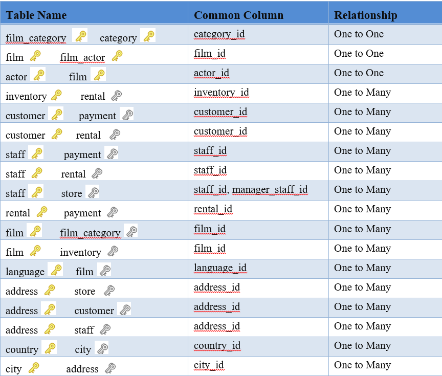

# Video-Rental-Store-Database-Analysis
An Analysis to optimise the performance of the DVD rental store through targeted marketing campaigns, operational improvements, customer loyalty programs, and effective inventory management.

---
*(Disclaimer: This is a fictitious company. The picture below is gotten from google)*

## Introduction:

In order to gain insights into a DVD rental store's operations and customer behavior the database of the store was analysed using PostgreSQL. 
The results from the analysis will show the following information:
* Total number of films in each category
* Top 5 customers who have rented the most films.
* Number of rentals per month for the past year.
* Total revenue generated by each store.

In addition, actionable insights and recommendations will be generated based on the analysis.
The implementation of this project will be achieved using the postgreSQL database where the datasets will be stored and pgAdmin to run the queries necessary to analyze the datasets

---
## Objectives:

This project will focus on four (4) main goal which include:
+ Analyze the database schema to understand the relationships between different tables.
+ Answer specific business questions by retrieving relevant data using SQL queries.
+ Perform data manipulation and transformation to prepare the data for analysis.
+ Produce insights and recommendations based on the analysis of the rental store data

---
## Database Schema Analysis:
**Primary keys** are unique identifiers for tables. They consist of a column or a set of columns that uniquely identifies each row in a table. A primary key has two main properties:
1.	Uniqueness: Each value in the primary key column(s) must be unique across all rows in the table ensuring that no two rows have the same value i.e. non-repetitive values. 
2.	Not Null: No NULL values must be present in a primary key column. Every row must have a valid, unique value.

Primary keys are identified by a yellow key icon in the schema diagram. It is also denoted by [PK] in the column header of a table. A primary key is generally used to establish relationships between tables, often in conjunction with foreign keys.

**Foreign key**: A column (or group of columns) in one table that is used to create a connection or relationship to a primary key or unique key in another table is called a foreign key. In other words, foreign keys establish relationships between tables by referencing primary keys of other tables. It is usually denoted by a grey colored key symbol.
A value in the foreign key column must either exist in the referenced column of the other table or be NULL if permitted, in order for the foreign key to maintain referential integrity between the two tables.

### Relationship between table
There are four (4) different types of relationships that exist between tables in a relational database. They include:
* One to One (1:1)
* One to Many (1:N)
* Many to One (N:1)
* Many to Many (N:M)

*The table below depicts the interaction between the entities in the database.*

