# Video-Rental-Store-Database-Analysis
An Analysis to gain insights into a DVD rental store's operations and customer behaviour and to improve the performance of the store. 

---
*(Disclaimer: This is a fictitious company. The picture below is gotten from google)*

## Introduction:

The database of the store was analysed using PostgreSQL. 
The results from the analysis will show the following information:
* Total number of films in each category
* Top 5 customers who have rented the most films.
* Number of rentals per month for the past year.
* Total revenue generated by each store.

In addition, actionable insights and recommendations will be generated based on the analysis.

---
## Objectives:

This project will focus on four (4) main goals which include:
+ Analyze the database schema to understand the relationships between different tables.
+ Answer specific business questions by retrieving relevant data using SQL queries.
+ Perform data manipulation and transformation to prepare the data for analysis.
+ Produce insights and recommendations based on the analysis of the rental store data

---
## Data Source

The dataset used for this project was a PostgreSQL database provided by my Tutor from the Tech Institute: Dahel Techies. PgAdmin was used to run the queries necessary to analyze the datasets.

---
## Database Schema Analysis:
**Primary keys** are unique identifiers for tables. They consist of a column or a set of columns that uniquely identifies each row in a table. A primary key has two main properties:
1.	Uniqueness: Each value in the primary key column(s) must be unique across all rows in the table ensuring that no two rows have the same value i.e. non-repetitive values. 
2.	Not Null: No NULL values must be present in a primary key column. Every row must have a valid, unique value.

Primary keys are identified by a yellow key icon in the schema diagram. It is also denoted by [PK] in the column header of a table. A primary key is generally used to establish relationships between tables, often in conjunction with foreign keys.

**Foreign key**: A column (or group of columns) in one table that is used to create a connection or relationship to a primary key or unique key in another table is called a foreign key. In other words, foreign keys establish relationships between tables by referencing the primary keys of other tables. It is usually denoted by a grey colored key symbol.
A value in the foreign key column must either exist in the referenced column of the other table or be NULL if permitted, in order for the foreign key to maintain referential integrity between the two tables.

### Relationship between table
There are four (4) different types of relationships that exist between tables in a relational database. They include:
* One to One (1:1)
* One to Many (1:N)
* Many to One (N:1)
* Many to Many (N:M)

*The table below depicts the interaction between the entities in the database.*

---
The Entity Relationship (ER) Diagram below gives a pictorial representation of the relationship between the tables in the database.

---
## Data Retrieval and Analysis:
Several structured queries were written to retrieve information from the database using the following:

* Aggregate functions to calculate totals and averages.
* Joins to link relevant tables to gather information.
* Sub-queries to enable detailed breakdown of data.

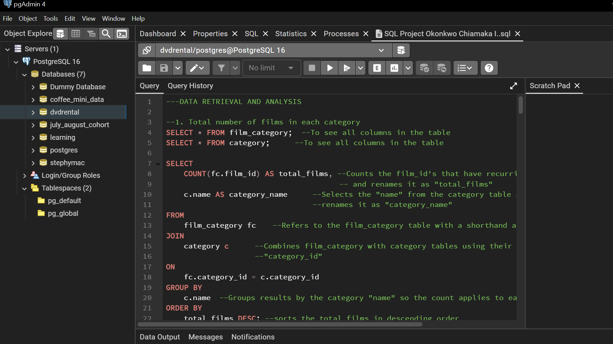

The subsequent results were obtained:

1.	**Total number of films in each category**
   
The top 3 categories were Sports, Foreign and Family with 74, 73 and 69 films respectively, while the category with the least number of films was Music, with 51 films. 

|   **SQL Query**  | **Output**  |
|    --------  | ---------  | 
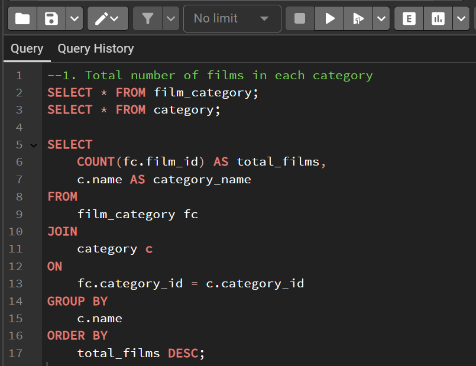 | 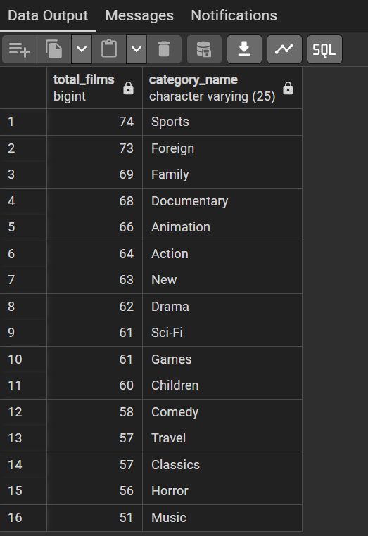

2.	**Top 5 customers who rented the most films**

|   **SQL Query**  | **Output**  |
|    --------  | ---------  | 
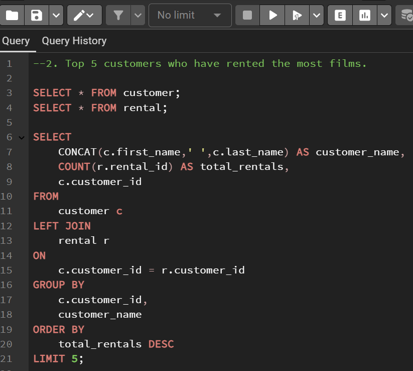 | 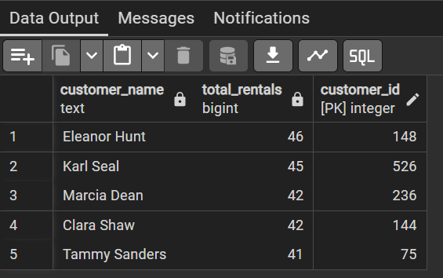

3.	**Number of rentals per month for the past year**

|   **SQL Query**  | **Output**  |
|    --------  | ---------  | 
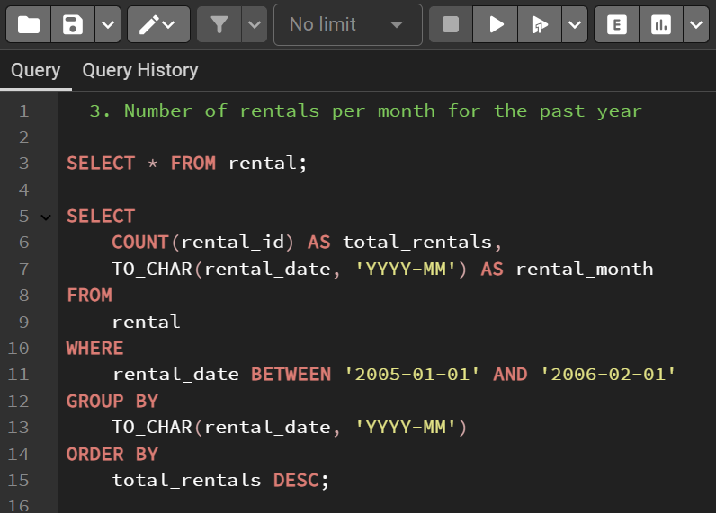 | 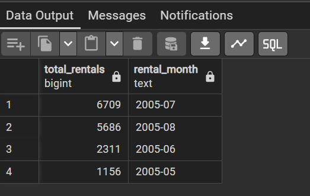

4.	**Total revenue generated by each store**

|   **SQL Query**  | **Output**  |
|    --------  | ---------  | 
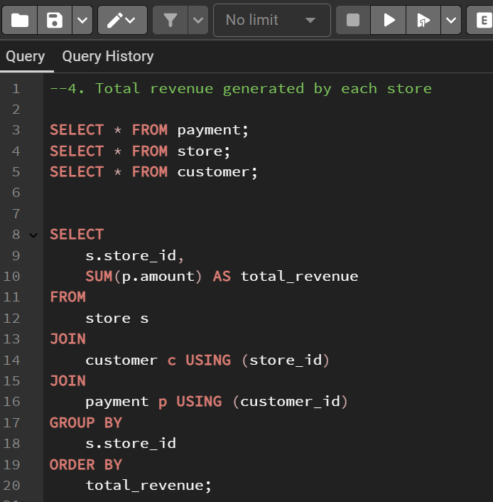 | 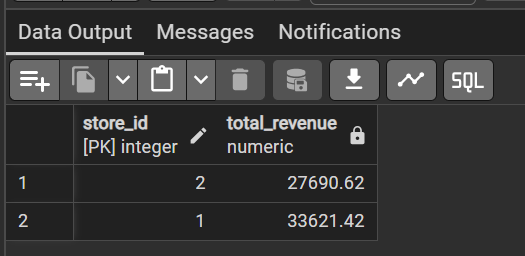

---

## Data Manipulation and Transformation:

To support further analysis, data manipulation and transformation were performed and the results for the following were obtained:

* Average rental duration for each film.

|   **SQL Query**  | **Output**  |
|    --------  | ---------  | 
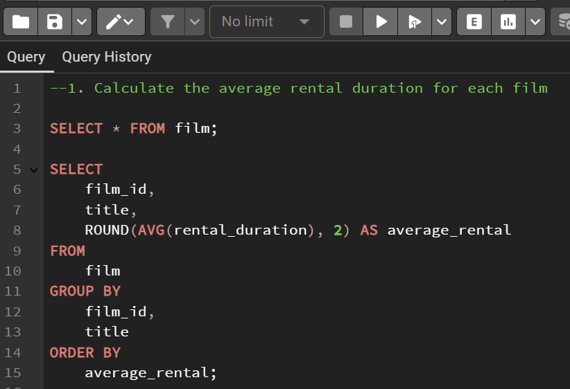 | 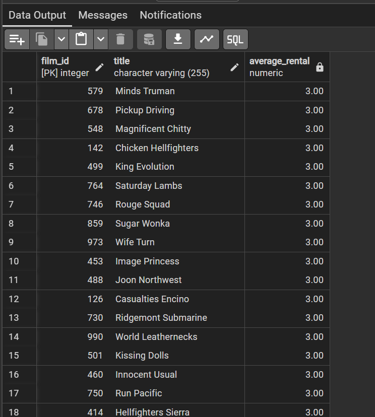
  
* Films not rented in the last 90 days i.e. which films have 'null' rental_id in the last 90 days.

|   **SQL Query**  | **Output**  |
|    --------  | ---------  | 
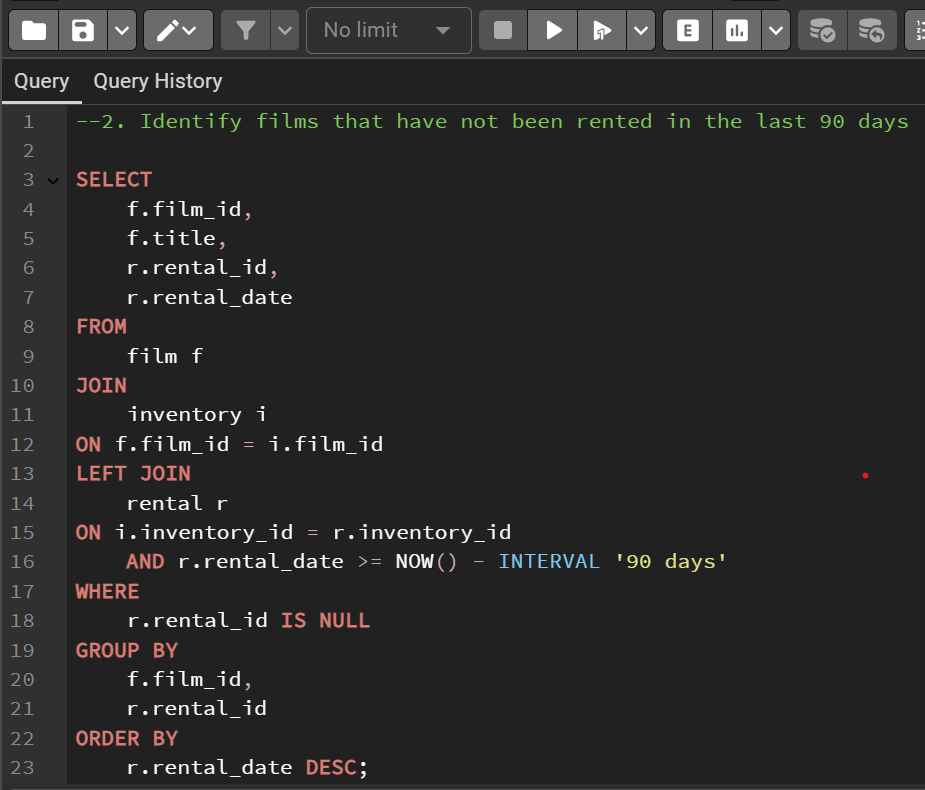 | 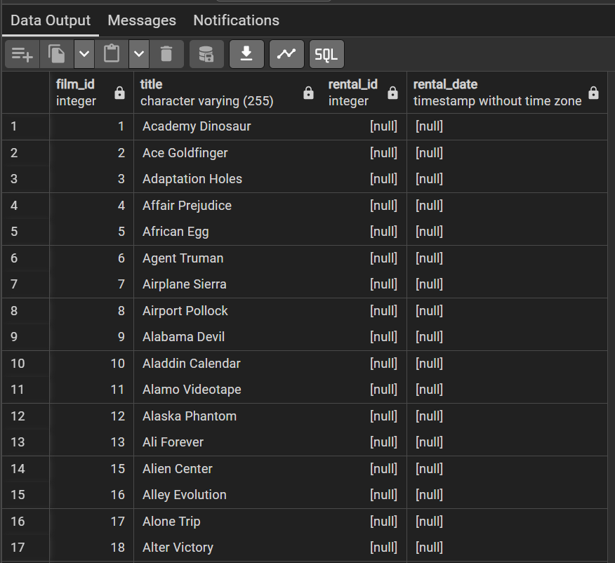

The rental table was also updated to include the return “status” of the rentals (overdue) based on the return date and rental duration. 

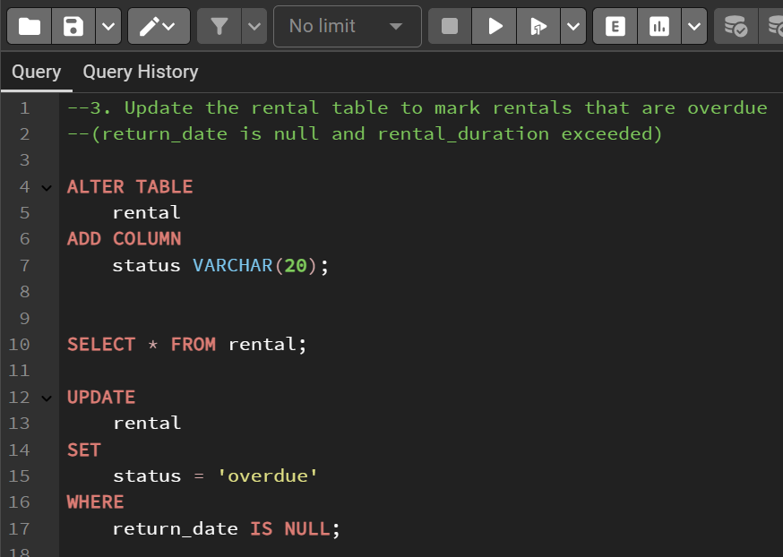

*(Please Note: I have attached the SQL file containing the written Queries [here](SQL_Project_Okonkwo_Chiamaka_I..SQL))*

---
## Data Analysis and Insights:

Analyzed rental patterns to derive actionable insights and make recommendations:

**Popular Films**

The two most popular films out of the 1000 movies the store offers are Bucket Brotherhood and Rocketeer Mother racking up rental numbers to 34 and 33 respectively, indicating their popularity among customers. *(See attached SQL document for the PostgreSQL query)*

**Popular Film Categories**

The DVD rental shop offers films across 16 categories. Films in the categories of "Sports", "Animation", and “Action” showed the highest rentals, the most popular category being Sports with the highest rentals across several customers followed closely by Animation. *(See attached SQL document for the PostgreSQL query)*

**Rental trends**

There is a significantly low number of rentals in May with a sharp increase in July and a slight drop in the subsequent month. This indicates that rentals peaked during the holiday seasons (summer months). Also, weekdays showed lower rentals compared to weekends. *(See attached SQL document for the PostgreSQL query)*

**Top 5 Customers**

The top-performing customers rented significantly more films, contributing to a large portion of the store’s revenue. These customers can be targeted for loyalty programs.
*(See attached SQL document for the PostgreSQL query)*

**Revenue by Stores**

Store 2 generated slightly higher revenues than Store 1. The small revenue gap indicates that both stores may have similar customer reach or sales strategies, but factors such as operations or market conditions could be the leading cause of the varying revenue. *(See attached SQL document for the PostgreSQL query)*

**Late Returns and Overdue Rentals**

<ins>Patterns in Late Returns</ins>: Customers renting popular films were more likely to return films late.

<ins>Overdue Rentals</ins>: About 10% of all rentals exceeded the allowed rental duration without a return.

## Recommendations:

Based on the analysis, the general performance of the DVD rental store could be optimized through targeted marketing campaigns, operational improvements, customer loyalty programs, and effective inventory management.

1.	**Inventory Management**

<ins>Increase Stock of Popular Categories</ins>: Focus on increasing inventory for Sports, Animation, Action, Sci-Fi, and Family genres.

<ins>Seasonal Inventory Adjustments</ins>: Stock more films ahead of peak rental seasons (festive periods, summer holidays).

2.	Customer Engagement

<ins>Loyalty Program for Top Customers</ins>: Reward high-performing customers with discounts or free rentals to encourage more patronage.

<ins>Targeted Marketing</ins>: Use insights to tailor promotional offers to specific customer demographics. (e.g. families, students)

3.	Operational Improvements

<ins>Improve Late Return Management</ins>: Introduce SMS/email reminders for due dates and implement penalties for overdue rentals.

<ins>Agent Performance</ins>: Provide incentives for agents contributing significantly to rentals and revenue.

4.	Data-Driven Decision Making

<ins>Monitor Monthly Trends</ins>: Use dashboards to track rental patterns and adjust operations accordingly.

<ins>Enhance Reporting</ins>: Regularly update metrics such as rentals per month, customer segments, and revenue per store.
 
---

## Conclusion:

The business model of the DVD rental store is examined from a number of perspectives, revealing multiple opportunities for growth, efficiency, and client interaction. The information emphasizes the significance of targeted marketing campaigns, operational improvements, customer loyalty programs, and effective inventory management.

Significant insights include seasonal increases in rentals, strong client loyalty from top renters, and a high demand for particular movie categories. Although the two stores' performance is comparable, minor differences point to the possibility of specific improvement. Low-performing films and rental duration trends also offer useful information for enhancing customer satisfaction and inventory management. Even though it can be difficult, overdue rentals can be avoided with improved communication, monitoring, and enforcement of the company’s policy.

The DVD rental store could establish a more stable, customer-focused business, address areas of concern, and build on its strengths by putting the suggested changes into practice. In addition to increasing income and efficiency, this strategy will establish the store as a top location for renting films, which will promote consistent growth and long-term success.

